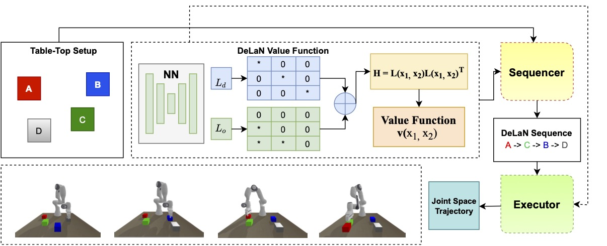

# Learning Arc-Length Value Function for Fast Time-Optimal Pick and Place Sequence Planning and Execution

  
click on the Binder symbol to open up the interactive jupyter-session and to run examples

This paper presents a real-time algorithm for computing the
optimal sequence and motion plans for a fixed-base
manipulator to pick and place a set of given objects. The
optimality is defined in terms of the total execution time
of the sequence or its proxy the arc-length in the
joint-space. The fundamental complexity stems from the fact
that the optimality metric depends on the joint motion, but
the task specification is in the end-effector space.
Moreover, mapping between a pair of end-effector positions
to the shortest arc-length joint trajectory is not
analytic; instead, it entails solving a complex trajectory
optimization problem. Existing works ignore this complex
mapping and use the Euclidean distance in the end-effector
space to compute the sequence. In this paper, we overcome
the reliance on the Euclidean distance heuristic by
introducing a novel data-driven technique to estimate the
optimal arc-length cost in joint space (a.k.a the value
function) between two given end-effector positions. We
parametrize the value function as a Neural Network and
motivate a niche choice for its architecture, inspired by
the works on metric learning. The learned value function is
then used as an edge cost in a capacitated vehicle routing
problem (CVRP) set-up to compute the optimal visitation
sequence. Finally, we optimize over the input space of the
learnt value function network to propose a novel Inverse
Kinematics (IK) algorithm that produces substantially
shorter joint arc-length trajectories than existing
approaches while executing the computed optimal sequence.
We show that our sequence planner, in combination with our
proposed IK, offers a substantial improvement in joint
arc-length over existing state-of-the-art while maintaining
scalability to a large number of objects.

### **python examples**:
* **DeLaN_IK.ipynb** (implementation of DeLaN metric-Ik planner)
* **Sequence_compare.ipynb** (implemention of  DeLaN n/w infrence to get optimal  rearrangement Sequence)
## C++ implementation :
C++ implementation of our proposed DeLaN Metric-IK is given in c_folder directory

## offline setup :
* create A conda environment from environment_complete.yml file

    conda env create -f environment_complete.yml
